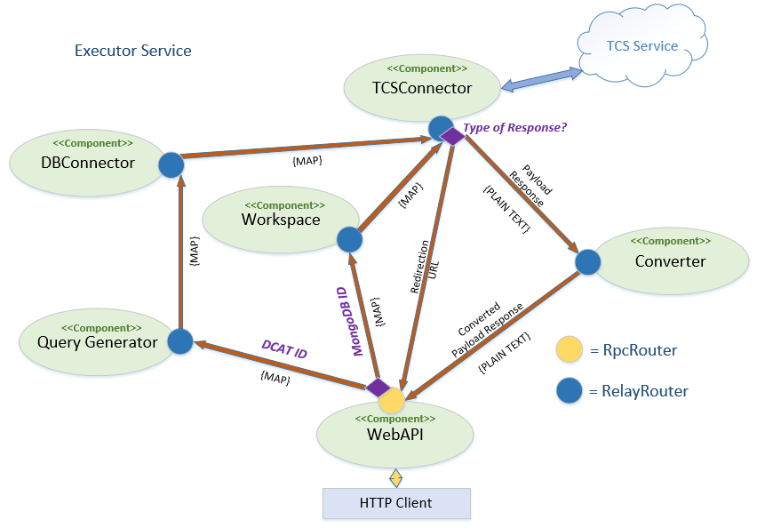
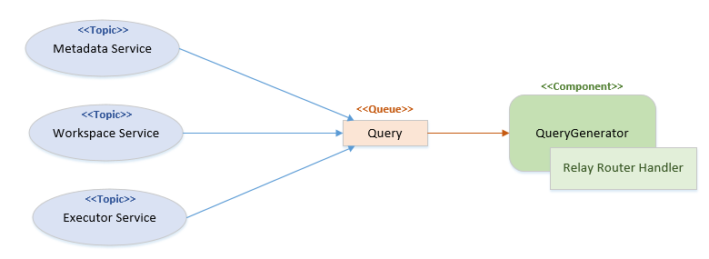
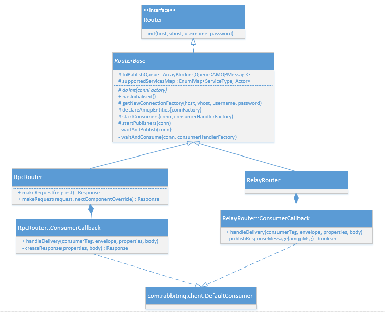
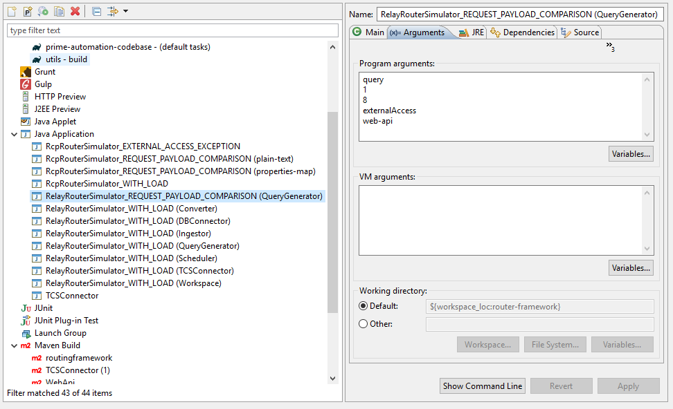
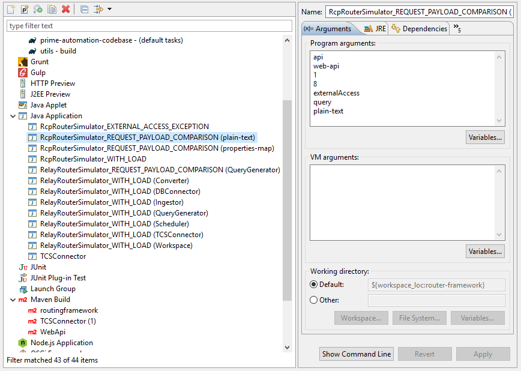

# <span style="color:darkgreen;font-size: 20pt">RoutingFramework</span>
   
## <span style="color:green;font-size: 18pt">Introduction</span>

### <span style="color:forestgreen;font-size: 16pt">Overview</span>
This framework enables EPOS components, written in Java, to connect to the ICS-C message bus and allow components to communicate with each other. The framework's main aim is to reduce the amount of code a component needs to write for message communication to a minimum.

It supports a specific architectural style of communication which may be best described as _Chained Remote Procedure Calling_. The Remote Procedure Call (RPC) part refers to the fact that a request will originate from some component (e.g. the WebAPI component as a result of a HTTP request) and then be passed to another for processing. The initiating component then waits for a response to come back. (At present the process initiating the request will be blocked until the response is received.) <sup>[1]</sup>

The "chained" part of _chained Remote Procedure calling_ refers to the fact that there can be multiple components involved in the generation of the response  passed back to the initiating component.

Another aspect of the architecture is that for a given request there is no parallel component processing, so no forking/joining capability is supported: A message will flow from one component to the next in a serial manner. In Message-Orientated middleware (MOM) terminolgy this implies message communication adheres more to a message queueing model rather than a publish-subscribe model.

The implementation is specific to the technology underlying the ICS-C message bus, which consists of the **RabbitMQ** message broker using the **AMQP (Advanced Message Queuing Protocol)** protocol.

### <span style="color:forestgreen;font-size: 16pt">Aims</span>

The framework aims to encapsulate all code necessary for inter-message communication within the ICS-C system in a single framework, and expose a simple API to clients (i.e. the components of the ICS-C).

Implicit in this is the need to support the _chained Remote Procedure Calling_ style of communication that the ICS-C assumes.

There are also a number of non-functional aims covered below:
1. Router implementations should be ignorant about the originating nature of the requests it received (e.g. for  requests prompted by a HTTP request ensure no knowledge about HTTP requests is assumed).
2. Ensure the framework's client does not have visibility of the framework's underlying RabbitMQ message broker and the AMQP protocol used (therefore affording all the benefits of good encapsulation).
3. Ensure the solution affords good performance and scalability.


### <span style="color:forestgreen;font-size: 16pt">Historic Note</span>
Prior versions of the ICS-C (pre-September 2019) made use of another framework to aid inter-component communication, called _MQManager_. It had a similar aim: To encapsulate all code necessary for inter-message communication, supporting a similar architectural style of communication as the _RouterFrameowrk_.

However, the _MQManager_' framework had a narrower scope in one important respect: it did not attempt to support the entire _chained Remote Procedure Calling_ messaging architecture; it supported only communication between intermediate components. Request-initiating/Reponse-receiving components needed to implement their own request publishing and response correlation functionality.

Therefore, with the introduction of the _RoutingFramework_ a lot of classes from the WebAPI could be removed (e.g. _it.system.api.SystemConnectionAMQP_ class which dealt with RabbitMQ connections directly).

### <span style="color:forestgreen;font-size: 16pt">Scope</span>
The document provides detail relating to the framework used to support inter-component communication within the ICS-C system.  The topic of inter-component communication is, however, of particular importance across modules and so is a topic covered in by the system architecture documentation.

This module-level document is primarily concerned with implementation detail of the framework that enables inter-component communication whilst also covering some necessary context.

  
## <span style="color:green;font-size: 18pt">Module Description</span>

### <span style="color:forestgreen;font-size: 16pt">Overview</span>
Components needing to connect to the ICS-C message bus using the _RoutingFramework_ do so via a Router instance that is created and configured by the component itself.

The _RoutingFramework_ supports 2 flavours of routers; one for initiating requests/receiving responses (_RpcRouter_), and one for handling incoming messages/forwarding on (_RelayRouter_). These Router instances are designed to be shared by multiple services and therefore a component should only need to manage at most 2 Router instances; an _RpcRouter_ and a _RelayRouter_. However, typically a given component will manage only one.

For example, in the current ICS-C  architecture the _WebAPI_ component initiates most requests, and is therefore the main component using an _RpcRouter_; other components help in the handling of the request/responses but are not responsible for initiating new requests. These therefore only make use of a _RelayRouter_ instnace.

However, the framework was designed to be flexible enough to support other component architectures. For example, a future requirement may be to expose EPOS metadata for OAI harvesting via REST, and SOAP or GraphML APIs. In this scenario it's possible a new component would be introduced to serve up metadata in various formats and expose it via a SOAP or GraphML API. This new component could also make use of an _RpcRouter_ but maybe also a _RelayRouter_ if the existing WebAPI is co-opted for the OAI harvesting's REST API.

See below for an example of the inter-component communication for one of the services that EPOS supports (_executor service_).


_Fig.1_

In this diagram the uni-direction arrows represent message flow between components. Although not explicitly displayed on the diagram each arrow represents a queueing and routing of messages by the message broker.
This service involves 6 of the ICS-C components: the initiating/terminating WebAPI component and 5 relaying components.
Notice that the WebAPI component in this service can route a message to either the _Workspace_ component or the _Query Generator_ component depending on some given condition (i.e. does the incoming ID parameter conform to a MongoDB ID or a DCAT ID format).
One of the RelayRouting components is also seen to support a conditional routing (_TCSConnector_). Here a message can be routed to either the _Converter_ or direct to the _WebAPI_ depending on the type of response being received from the TCS service.

Each component is responsible for indicating which services it supports when configuring its Router(s).
They are also responsible for indicating which component is next in the RPC chain as well as any additional decision logic (such as that seen with the _TCSConnector_ on the diagram above).

For conditional routing seen with RpcRouters (such as that seen with the _WebAPI_ on the diagram above) it is the responsibility of the component's calling code to specify the conditional routing at the time a request is made.

It is intended that all components involved in supporting these request/response RPC chains all use the same version of the _RouterFramework_.


### <span style="color:forestgreen;font-size: 16pt">Routers</span>

Router instances are configured and created using their respective builders (_RpcRouterBuilder.class_ and _RelayRouterBuilder.class_). The 2 builder APIs are similar in that both support configuration for the following:

1. Identification of the component managing the Router instance
2. Service to be supported, along with an indication of the next component in the RPC chain
3. Number of publishing threads/channels to be made available
4. Number of consuming threads/channels to be made available

The Router instance returned from these builders are wrapped in an ``java.util.Optional`` type, with an empty instance indicating a validation failure against the supplied configuration; specifically, if no service support has been added. Defaults for the other parameters are used if none has been explicitly supplied though. And during Router initialisation these adopted defaults will be reported in the logs.

The client's call to initialise the Routers is also the same. It takes the location and authentication details to be used to connect to the message broker used by the _RoutingFramework_.

During this initialisation phase the Router will make a connection to the message broker and create any required broker entities (e.g. queues, exchanges, bindings) before spinning up the threads/channels ready for publishing and consuming messages. Because this initialisation phase entails establishing connections to a remote system, any connection/network issues lead to exceptions being thrown. The exception used for this is a custom exception type, ``org.epos.router_framework.exception.RouterException``.

#### <span style="color:seagreen;font-size: 16pt">RpcRouter</span>

#### <span style="color:limegreen;font-size: 14pt">Configuration</span>

See below for example client code for the building of an _RpcRouter_ instance.


```Java
	Optional<RpcRouter> _router = RpcRouterBuilder.instance(Actor.WEB_API)
    	.addServiceSupport(ServiceType.METADATA, Actor.QUERY_GENERATOR)
    	.addServiceSupport(ServiceType.WORKSPACE, Actor.WORKSPACE)
    	.addServiceSupport(ServiceType.EXTERNAL, Actor.TCS_CONNECTOR)
    	.addServiceSupport(ServiceType.SCHEDULER, Actor.DB_CONNECTOR)
    	.addServiceSupport(ServiceType.INGESTOR, Actor.INGESTOR)
    	.setNumberOfPublishers(8)
    	.setNumberOfConsumers(10)
    	.setTtlInProcessor(8_500)    // 8.5 seconds
    	.setRoutingKeyPrefix("api")
    	.build();
    	
   RpcRouter router = _router.orElseThrow(() -> new BeanInitializationException(
        		"Router instance for WebAPI component could not be instantiated"));
    	
   router.init(System.getenv("BROKER_HOST"), 
		System.getenv("BROKER_VHOST"), 
		System.getenv("BROKER_USERNAME"), 
		System.getenv("BROKER_PASSWORD"));
```

As can be seen from the above example the builder for the _RpcRouter_ supports 2 additional parameters specific to the _RpcRouterBuilder_: a RoutingKeyPrefix (text to be used as a prefix to all the routing keys generated by the Router) and TtlInProcessor. The TtlInProcessor parameter overrides the TTL (in milliseconds) used by all downstream RelayRouters to instruct the timeout to be imposed on their client processors.

Once instantiation of a _RpcRouter_ has been attempted, it is being tested to ensure instantiation was successful. If not an exception thrown.

Then an attempt is made to initialise the router with the underlying message broker using the broker's credentials.
In this example they are taken from pre-defined environment variables:
* **host**			-   Host name/IP hosting the message broker   
* **virtual host**	-	RabbitMQ is a multi-tenant system so a tenant needs to be specified. The presence of this parameter on the method does indicate some dependency on the underlying message broker implementation. Ideally this would not have been the case, with the client code not having to directly deal with this configuration.   
* **username**		-	Of system user
* **password**		-   Of system user     


#### <span style="color:limegreen;font-size: 14pt">Making a request</span>

To use an _RpcRouter_ instance to submit a request to a service then a `org.epos.router_framework.domain.Request` object needs to be created.
For convenience a builder (``RequestBuilder``) can be used to create these ``Request`` objects.

As a minimum the builder needs to be supplied with  _ServiceType_, _OperationType_, _type of request_, and a _payload_.
The type of payload to be used is indicated by the builder method, _addPayloadPropertiesMap()_, and _addPayloadPlainText()_ invoked.

```Java
  Request request = RequestBuilder.instance(ServiceType.METADATA, "get", "resources.search")
							.addPayloadPropertiesMap(payload)
							.build());
```

Other optional configuration can also be specified using the ``addHeaders(Map<String, Object>)`` and ``addRequestTTL(int milliseconds)`` builder methods.

Adding a RequestTTL will override the default TTL (10.5 seconds). It will ensure an attempt is made to timeout the request with respect to the initiating component. 

The ``RequestBuilder`` will also carry out validation to ensure sufficient detail is supplied and is not contradictory.

The request can then be submitted to the Router instance and synchronous response will be returned.

```Java
	Response resp = router.makeRequest(req);
```
Alternatively, if there is a need to override the default next component (as defined for the service during Router instantiation) there is an overloaded version of _RpcRouter+makeRequest()_ which takes a second _Actor_ argument.

```Java
	Response resp = router.makeRequest(req, Actor.WORKSPACE);
```

The returned response (`org.epos.router_framework.domain.Response`) can be interrogated to determine the type of payload that has been returned and deal with it appropriately.

Here for example the response code is checked before obtaining the responses based on the return _PayloadType_ specified.

```Java
	if (ResponseCode.OK.equals(response.getResponseCode)) {
		switch (response.getPayloadType()) {
			case PLAIN_TEXT : {
		      String msg = response.getPayloadAsPlainText().get();
		      // do more
		      break;
		   }
			case PROPERTIES_MAP : {
				Map<String, String> resultMap = response.getPayloadAsPropertiesMap().get();
		      // do more
		      break;
		   }
		}
	}
```


#### <span style="color:limegreen;font-size: 14pt">Dealing with the Response</span>

At the time of submitting a request the client code cannot know for sure what type of payload is going to be received in the response; only the component submitting the response back to the initiating component knows this. The response entity (``org.epos.router_framework.domain.Response``) therefore also holds information about the response payload type, which the client can use to determine the correct getter to use to retrieve the payload. 

Here is an example of such calling code. The _Response_ entity currently has 2 methods available to retrieve payloads - _getPayloadAsPlainText()_ (returning a ``java.lang.String``) and _getPayloadAsPropertiesMap()_ (returning a ``Map<String, String>``). If one is called but the payload is of the other type then an _UnsupportedOperationException_ will be thrown. the _getPayloadType()_ method should therefore be consulted before trying to retrieve a payload.

```Java 
		switch (response.getPayloadType()) {
			case PLAIN_TEXT : {
	        	String resultStr = response.getPayloadAsPlainText().get()
	        	// do something with result text!
	        	break;
	    	}
			case PROPERTIES_MAP : {
				Map<String, String> resultMap = response.getPayloadAsPropertiesMap().get();
				// do something with result map!
				break;
			}
			default:
				throw new UnsupportedOperationException e);  
			}
		}
```

The _Response_ entity can also convey any error information. If one of the components in the RPC chain encounters an error, either due to issues with router's configuration or the message broker, then the component will abandon the request and make an attempt to return an error back to the initiating component.
In such cases an error code and error message values should be available.

Here is some example client code that interrogates the _Response_ for error information.  

```Java 
		if (response.getErrorCode().isPresent()) {
        	LOG.debug(response.getComponentAudit());
        	String errStr = String.format("[ERROR: %s] %s",
        				response.getErrorCode().get().name(),
        				response.getErrorMessage().isPresent() ? response.getErrorMessage().get() : "NONE");
        	LOG.debug(errStr);
		}
```

The _componentAudit_ property used above is also available even in the case of a successful request/response. It will report back the chain of components that  involved in the request/response chain in the format...

	Initiating-RPC-component > 1st_relay_component > ... > Nth_relay_component > Terminating_RPC_component

#### <span style="color:forestgreen;font-size: 16pt">Error Codes</span>

As mentioned in the previous subsection the _Response_ entity can convey error information. If an error has occurred then one of the follow error code should have be returned.

* **usage-error**               _Logic error with implementation occured_
* **timed-out**                 _Request exceeded specified time out_
* **external-access-error**     _External system involved in dealing with the request, fails, cannot be accessed, or times out_
* **internal-error**            _Network error e.g. RabbitMQ communication_
* **interrupted**               _Thread was interrupted_
* **logic-error**               _Unexpected logic error with core code_

All these error codes may warrant further investigation but who should initially investigate would depend on the error code.
A **timed-out** or **internal-error** code may at first be investigated by someone with an ops/infrastructure role as the issue could well be a transient network issue.
A **logic-error** or **usage-error** code should be investigated by a developer with access to the code base.

Accompanied with such an error code should be a further description of the root cause.

#### <span style="color:forestgreen;font-size: 16pt">RelayRouter</span>

#### <span style="color:limegreen;font-size: 14pt">Configuration</span>


```Java

		Function<Actor, PlainTextRelayRouterHandler> plainTextHandlerFactory = (nextActor) -> 
			new PlainTextRelayRouterHandler(nextActor) {

			@Override
			protected PayloadType getDefaultNextPayloadType() {
				return PayloadType.PLAIN_TEXT;
			}

			@Override
			public Object handle(String payload, ServiceType service, Map<String, Object> headers) {
				String plainTextResponse;
				…
				// determine plainTextResponse value
				…
				return plainTextResponse;
			}
		};


		Optional<RelayRouter> _router = RelayRouterBuilder.instance(Actor.QUERY_GENERATOR)
			.addServiceType(ServiceType.METADATA, Actor.DB_CONNECTOR)
			.addServiceType(ServiceType.WORKSPACE, Actor.DB_CONNECTOR)
			.addServiceType(ServiceType.EXTERNAL, Actor.DB_CONNECTOR)
			.addPlainTextPayloadTypeSupport((actor) -> new QueryGeneratorHandler(actor))
			.build();
			
		RelayRouter router = _router.orElseThrow(() -> new IllegalArgumentException(
        		"Router instance for Query Generator component could not be instantiated"));
		
		router.init(System.getenv("BROKER_HOST"),
				System.getenv("BROKER_VHOST"),
				System.getenv("BROKER_USERNAME"),
				System.getenv("BROKER_PASSWORD"));
```

As can be seen from the above example the builder for the _RelayRouter_ supports additional parameters that are specific to the ``RelayRouterBuilder`` - the _addPlainTextPayloadTypeSupport()_. This is a lambda expression that acts as a handler factory, used when processing messages.

Currently, there are 2 flavours of handlers that can be specified - one for each of the payload types supported: **Plain Text**, and **Property Maps**.
The _PlainTextRelayRouterHandler_ handler will expect message payloads in a plain text format (``java.lang.String``). The _PropertiesMapRelayRouterHandler_ will expect message payloads in a key-value map (``java.util.Map<String,String>``) format. (See next section for more details.)

If message payloads comprise of a list of properties then using the _Property Maps_ support should be preferable over maintaining, for example, JSONObjects with _Plain Text_ support. This is because with the AMQP protocol all payloads are transmitted as byte arrays. With _Property Maps_ support the Java type used (``java.util.Map<String,String>``) is directly serialised just before a message is sent and deserialised just after a message is received. If JSONObjects are used with _Plain Text_ support, payloads would still need to be serialised/deserialised from/to a Java type (i.e. ``java.lang.String``) but would also need to be converted to/from the JSONObject representation. This would incur an additional processing cost.

#### <span style="color:limegreen;font-size: 14pt">Handlers</span>

The message handlers for Relay Routers are implemented by sub-classing the abstract classes `org.epos.router_framework.handling.PropertiesMapRelayRouterHandler` and `org.epos.router_framework.handling.PlainTextRelayRouterHandler`.

The key method body to implement is the _handle()_ method. This takes as arguments, the payload (``java.lang.String`` or ``java.util.Map<String,String>``), the service type the message is associated with (``org.epos.router_framework.types.ServiceType``) and all the headers relating to the message's routing (``java.util.Map<String,Object>``).

The return type is an ``java.lang.Object``. Depending on the specified outgoing payload type, the specific type returned could be a ``Map<String,String>`` (``PayloadType.PROPERTIES_MAP``) or a ``String`` (``PayloadType.PLAIN_TEXT``).

Defaults are specified for both the next actor in the RPC chain and the outgoing payload type.

The default next actor is defined when the _RelayRouter_ is first configured (using the second argument of the addServiceType() builder method - see example in above section). This can be overridden in the handler() body if there a need for conditional routing as was seen for the TCSConnector component in Fig.1.

The default next Payload Type is set at the handler level itself through the implementation of the _getDefaultNextPayloadType()_ method. This field can also be overridden from within the _handler()_ code using the _setOverriddenNextPayloadType()_ method.

The method signatures for the _handle()_ methods also declare a ``RoutingExternalAccessException``.
This exception is used by the client code to indicate to its associated _RelayRouter_ that a valid Response could not be generated due to an issue with an external system (e.g. a TCS web service it depends on). As a result the Router will generate an error Response with an "external-access-error" code.

See below for an illustrative example for a ``PropertiesMapRelayRouterHander``. In this example the handler takes a payload as a properties map (``Map<String,String>``), transforms its content to a JSON representation, and returns it as plain text (``java.lang.String``).

```Java

	routerBuilder.addPropertiesMapPayloadTypeSupport((nextActor) -> new PropertiesMapRelayRouterHandler(nextActor) {

		@Override
		public Object handle(Map<String, String> payload, ServiceType service, Map<String, Object> headers) 
			throws RoutingExternalAccessException
		{
			var copy = payload.keySet().stream()
					.collect(Collectors.toMap(
							Function.identity(), 
							propName -> payload.get(propName).toString()));
			
			// convert back to JSON
			return GSON.toJson(copy);
		}

		@Override
		protected PayloadType getDefaultNextPayloadType() 
		{
			return PayloadType.PLAIN_TEXT;
		}

	});

```

### <span style="color:forestgreen;font-size: 16pt">Request Timeouts</span>

The _RouterFramework_ has 2 types of timeout - both operate on individual requests:

#### <span style="color:limegreen;font-size: 14pt">Request TTL</span>
The _Request TTL_ can be configured on a per-request basis using the optional ``addRequestTTL(int milliseconds)`` method on the  ``org.epos.router_framework.domain.RequestBuilder``. It is only considered by the ``RpcRouter`` instance that the ``Request`` is first passed to. If after publishing a concomitant AMQP message to the message bus and a correlated return message has not been received within the specified TTL then a ``Response``  is returned with a 'timed-out' error code. Note, however, that processing related to the request may still be occurring in other downstream components.

#### <span style="color:limegreen;font-size: 14pt">RelayRouter processor TTL</span>
The _RelayRouter Processor TTL_ can be configured on an ``RpcRouter`` instance using the optional ``setTtlInProcessor(int milliseconds)`` method on the ``org.epos.router_framework.RpcRouterBuilder``. This setting is stored within the request's AMQP messages and used by all downstream instances of ``RelayRouter``. Within a ``RelayRouter`` it will be used to enforce timeouts on its processor (the processor is the entity used to invoke the client handler code).

Imposing such a timeout ensures that hanging or very slow-response handler code does not hog RabbitMQ channels. If there is a processor timeout the ``RelayRouter`` instance will send an error response (with a 'timed-out' error code) back to the initiating component.


## <span style="color:green;font-size: 18pt">Module Design</span>

### <span style="color:forestgreen;font-size: 16pt">RouterFramework and AMQP concepts</span>

The underlying framework implementation does make use of _Topics_, which are typically associated more with publish-subscribe models, but here we use _Topics_ to represent the services the ICS-C supports. By doing this messages from various _Topics_ can be sent to the single queue that the component is monitoring. This means a component needs to implement just one message handler irrespective of the service that the incoming message is for. This practice seems to be preferable to requiring components provide implementations for each service, as there is typically more code branching related to the different types of request (_RequestType_) rather than the different services they support.



Upon initialisation both flavours of router will create separate TCP connections for publishing and consuming. Maintaining separate connections avoids the possibility of consumer performance being actively reduced if RabbitMQ is trying to control publisher rates. Such throttling is carried out at the connection level so a shared connection will affect both publishers and consumers.<sup>[2]</sup>


### <span style="color:forestgreen;font-size: 16pt">Router flavours</span>

The 2 types of router are implemented within the class hierarchy below, with the majority of the code residing in the shared abstract class, RouterBase.

Interaction with the underlying message broker, RabbitMQ, is via the standard _RabbitMQ Java Client_ library.



_Fig.3 Routers UML class diagram_


### <span style="color:forestgreen;font-size: 16pt">EPOS Header properties</span>

Each AMQP message maintains a collection of properties (``Map<String,Object> headers``). The _RoutingFramework_ makes use of this headers collection to record a number of values against the current message. These custom properties have keys that by convention are prefixed with "epos_", and are described below.  

 **epos_type-of-current-payload**   - Describes payload type using label corresponding to a org.epos\_ip.router\_framework.PayloadType 

 **epos_component-audit**           - Maintains the audit of components involved in the request/response chain
 
 **epos_operation-type**            - Describes the operation type declared in the initiating request
 
 **epos_request-type**           	- Describes the request type declared in the initiating request
 
 **epos_error-code**                - If an unrecoverable error occurred during a request/response, and the affected component was able to route an
                                      error response back to the initiating component then an indication of the error type would be recorded against 
                                      this property

 **epos_error-message**             - Records any error message that accompanies an error code.
 
 **epos_ttl-in-processor**			- A TTL (in milliseconds) used by all downstream _RelayRouter_ processors to enforce timeouts.
 
Their values are maintained via the component's Router instance.

Because the handle() callback methods of the Relay Router handlers pass in this header map, client code can interrogate it.
In the future it may be more ideal to ensure values required by handlers (beyond the prefined epos_* properties) are made available in the message payload. This would ensure the headers map contains values used only to hold generic information about the message / message routing purposes.


### <span style="color:forestgreen;font-size: 16pt">Routing Keys</span>

The routing keys specified when publishing messages to the message broker follow the format described below.
The first, prefix, part of the format is optional (specified during router configuration).

	{prefix-supplied-at-config}.{operation type}.{request type}.{next component}

An example routing key, following this format, could be...

	api.post.workspaces.workspacesconfig.workspace
	
Where "api" is a specified prefix; "workspaces.workspacesconfig" represents the request type; and "workspace" is the next component in the request/response chain.

### <span style="color:forestgreen;font-size: 16pt">Code</span>
Code is stored in the local GitLab instance (https://epos-ci.brgm.fr/epos/routingframework.git) and release versions published to Sonatype's Maven Central (https://search.maven.org/search?q=g:org.epos-eu.ics-c) via a Sonatype plugin.

The _RoutingFramework_ can be pulled from Maven Central using the following _groupId_ and _artifactId_:

	<groupId>org.epos-eu.ics-c</groupId>
	<artifactId>router-framework</artifactId>

The main code concerning the _RouterFramework_ can be found within the _org.epos_ip.router_framework_ packages.
Included in this is the package ``org.epos.router_framework.simulation`` which is concerned with simulating components solely for testing purposes (see next subsection).

Other packages do exist within this project (_org.epos.*_ packages) but they're primarily utility/helper classes that have been directly copied over from the previous, _MQManager_ framework so they can still be made available for use by client code. Such classes may be better housed in a common utils project that could be created at a later date.

  
### <span style="color:forestgreen;font-size: 16pt">Testing</span>

#### <span style="color:limegreen;font-size: 14pt">Simulation</span>

There are 2 main types of simulator class available, one used to simulate an _RpcRouter_ instance (_RpcRouterSimulator\_\*_) and one used to simulate an _RelayRouter_ instance (_RelayRouterSimulator\_\*_). These together can be used to simulate chained RPC setups.

For example, the below Eclipse run configuration simulates the routing for a QueryGenerator component.



The arguments passed in represent the component being simulated, the number of publisher instances, the number of consumer instances, the service being supported, and the next default component in that services RPC request/response chain.
Here, there is only 1 services being supported (External service).

A JVM instance with an _RpcRouterSimulator*_ entry point can be used to simulate an _RpcRouter_ for the WebAPI component.

For example, the below Eclipse run configuration simulates the WebAPI component making requests using Plain Text payloads.




### <span style="color:forestgreen;font-size: 16pt">Logging</span>
The project uses the SL4J Logging API with the the simple LogBack implementation.

Configuration for this is done via the _logback.xml_ file. By default, logging in the production environment is expected to be set to INFO level.
Extensive DEBUG level logging does, however, exist in the code to aid with issue diagnosis but this level of logging could noticeably affect performance. 


## <span style="color:green;font-size: 18pt">Deployment</span>

The _RouterFramework_ is deployed as a self-contained library (jar file), albeit with a dependency on a message broker implementation (RabbitMQ).
It is built using the Maven build tool. Typically it will be pulled in as a dependency to any ICS-C component requiring access to the system's message bus.

To make use of the RouterFramework within a component then add the following dependency to your Maven project's pom.xml, within the \<dependencies\> section:

```xml
		<dependency>
			<groupId>org.epos-eu.ics-c</groupId>
			<artifactId>router-framework</artifactId>
			<version>{add version number here}</version>
		</dependency>
```

The binaries for the built artefact (along with source code) are currently published to Maven Central  via Sonatype's OSSRH (OSS Repository Hosting) as an open-source project:
[RouterFramework on Sonatype](https://search.maven.org/search?q=a:router-framework)

The project's pom.xml therefore also needs to include a </distibutionManagement> section which declares a repo, and optionally a repo for snapshot artefacts.

```xml
	<distributionManagement>
		<snapshotRepository>
			<id>ossrh</id>
			<url>https://oss.sonatype.org/content/repositories/snapshots</url>
		</snapshotRepository>
		<repository>
			<id>ossrh</id>
			<url>https://oss.sonatype.org/service/local/staging/deploy/maven2/</url>
		</repository>
	</distributionManagement>
```

Credentials for the repo will also need to be added to the setting.xml file.

```xml
	<server>
		<id>ossrh</id>
		<username>{osshr username here}</username>
		<password>{osshr password here}</password>
	</server>
```

Publishing to Sonatype's OSSRH is achieved using Sonatype's _nexus-staging-maven-plugin_ which will need to be added to the \<build\>\<plugins\> section:

```xml
	<plugin>
		<groupId>org.sonatype.plugins</groupId>
		<artifactId>nexus-staging-maven-plugin</artifactId>
		<version>1.6.8</version>
		<extensions>true</extensions>
		<configuration>
			<serverId>ossrh</serverId>
			<nexusUrl>https://oss.sonatype.org/</nexusUrl>
			<autoReleaseAfterClose>true</autoReleaseAfterClose>
		</configuration>
	</plugin>
```

One requirement to be able to publish to the OSSRH is that all artefacts to be published must be signed. This is achieved using the _maven-gpg-plugin_, declared in the project's pom.xml as...

```xml
	<plugin>
		<groupId>org.apache.maven.plugins</groupId>
		<artifactId>maven-gpg-plugin</artifactId>
		<version>1.5</version>
		<executions>
			<execution>
				<id>sign-artifacts</id>
				<phase>verify</phase>
				<goals>
					<goal>sign</goal>
				</goals>
			</execution>
		</executions>
	</plugin>
```

Any developer needing to modify the _RouterFramework_ and carry out local testing (requiring the _RouterFramework_ to be published to their local .m2 repo) will need to install GPG, generate their own key, and declare it in settings.xml's \<profile\> section of the active profile being used <sup>[3]</sup>.
 
For example...

```xml
	<profile>
		<id>ossrh</id>
		<activation>
			<activeByDefault>true</activeByDefault>
		</activation>
		<properties>
			<gpg.executable>gpg</gpg.executable>
			<gpg.passphrase>{passphrase used to generate key in local keystore}</gpg.passphrase>
		</properties>
	</profile>
```


## <span style="color:green;font-size: 18pt">References</span>

\[1\] [Link Simplistic RPC implementation](https://www.rabbitmq.com/tutorials/tutorial-six-java.html)

\[2\] [Link Rationale for maintaining separate connections for publishing and consuming](https://medium.com/@aloksinghal/rabbitmq-best-practices-part-1-6f66522e4fe)

\[3\] [Link OSSRH Prerequisites](https://central.sonatype.org/pages/ossrh-guide.html) 

